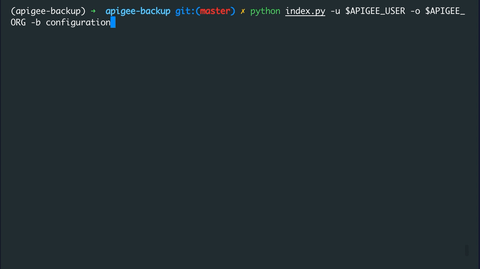

# [WIP] apigee-backup

Use this tool to take backup of configuration item and entities from Apigee Edge organization/environment.


## Backup Configurations

Below are the configurations/entities for which you can take the backup,

- `bundle`: apis, sharedflows
- `configuration`: keyvaluemaps, targetservers, keystores, virtualhosts, references
- `publish`: apiproducts, apps, developers

## Installing the Tool

1. Download and Install Python
    > <https://www.python.org/downloads/>

2. Run the below commands to clone the repo and use the tool
```
git clone https://github.com/rhythm-arora/APIGEE.git
cd APIGEE
pip install pipenv
pipenv shell
```

## Usage

`python index.py [-h] -u USERNAME -o ORG -b {configuration,publish,bundle}`

